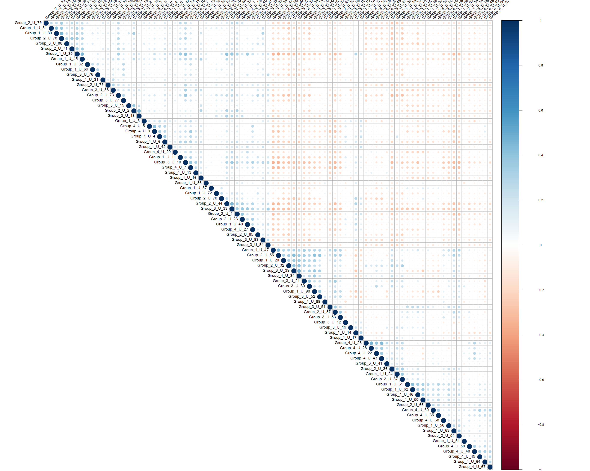

# LiverLipidCoders
The focus of this project is to develop a machine learning algorithm using the plasma lipid data provided to provide staging for a patient’s liver disease diagnosis. 

## Introduction
There are four main stages of liver disease:
  1. Normal: Healthy condition.
  2. Steatosis: Liver is fatty. Reversible. Can be diagnosed via a blood test.
  3. Steatohepatisis: Liver is fatty and inflamed. Reversible. Can only be diagnosed via a biopsy.
  4. Cirrhosis: Liver is dying. Non-reversible.
  
Through machine-learning-based staging of disease and identification of relevant biomarkers in plasma, patients can avoid the process of an intrusive biopsy (for stage 3) and still receive an accurate diagnosis of the disease. Our team conducted statistical analyses on a small sample of patient data to determine whether further investigation of similar techniques is beneficial.

## Exploratory Analysis
We created a correlation matrix for the normalized data of all 1846 lipids. Only about 400 of these are known and labeled, but all of them can potentially contribute to the staging of the disease.

We also created a correlation matrix for all 87 patient samples. Though we have 90 total, the stages of 3 of the samples are unknown and were therefore removed from consideration for training.

## Lipid Markers for Stage 3
We focused on feature selection and dimension reduction so we could identify lipids especially relevant to staging. We created a list of known and unknown lipid signals that contribute the most to the automated classification of steatohepatisis (stage 3):

