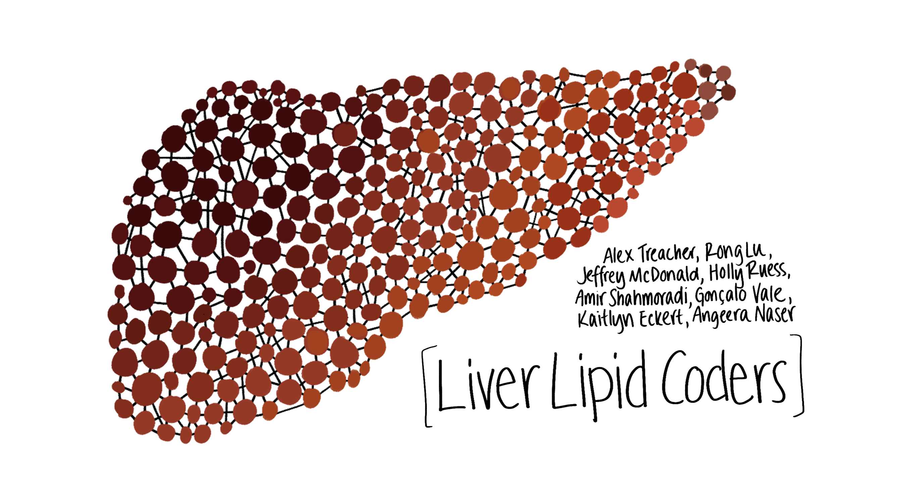
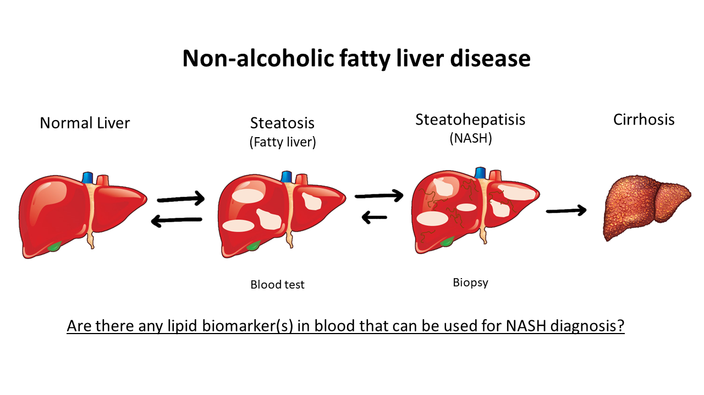

# LiverLipidCoders
The focus of this project is to develop a machine learning algorithm using the plasma lipid data provided to provide staging for a patient’s liver disease diagnosis. 

## Introduction
There are four main stages of liver disease:
  1. Normal: Healthy condition.
  2. Steatosis: Liver is fatty. Reversible. Can be diagnosed via a blood test.
  3. Steatohepatisis: Liver is fatty and inflamed. Reversible. Can only be diagnosed via a biopsy.
  4. Cirrhosis: Liver is dying. Non-reversible.
  
Through machine-learning-based staging of disease and identification of relevant biomarkers in plasma, patients can avoid the process of an intrusive biopsy (for stage 3) and still receive an accurate diagnosis of the disease. Our team conducted statistical analyses on a small sample of patient data to determine whether further investigation of similar techniques is beneficial.

## Lipid Markers for Stage 3
We focused on feature selection and dimension reduction so we could identify lipids especially relevant to staging. We created a list of known and unknown lipid signals that contribute the most to the automated classification of steatohepatisis (stage 3):

## Dense Neural Network
Using all the named lipids, we normalized the data and trained 281 different architectures and used the best to classify between F1/F2, F3, and F4.

